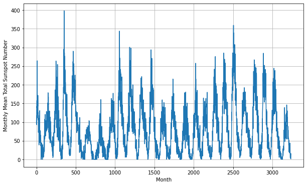
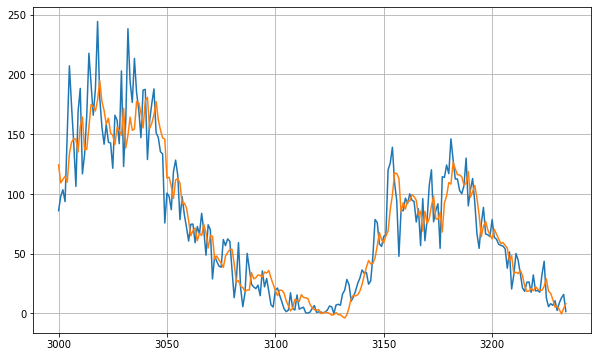
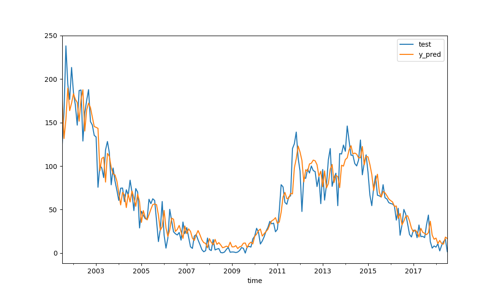

## GemCity ML: Green AI
### October, 19 2023
### Evelyn J. Boettcher

Last year I gave a talk on how to use Tensorflow to predict when we will have another sunspot,from a tutorial from DeepLearning AI:
 
[Deeplearning-AI worksheet on fitting Sun Spot data with timeseries](https://github.com/https-deeplearning-ai/tensorflow-1-public/blob/main/C4/W4/ungraded_labs/C4_W4_Lab_3_Sunspots_CNN_RNN_DNN.ipynb)

| Raw data | Prediction |
|:---:|:---:|
|  ||

### This go around

Going to use a green algorithm: SVD.

Green AI are a group of classical algorithms that use information about the system to predict / classify.  They have the following advantages:

* Fast to train
* Fast to run
* Many cases probability is meaningful.

| SVD Prediction |
|:----- |
|  |

They fail at object detection in images, but there are many other use cases.

https://sthalles.github.io/svd-for-regression/ 

